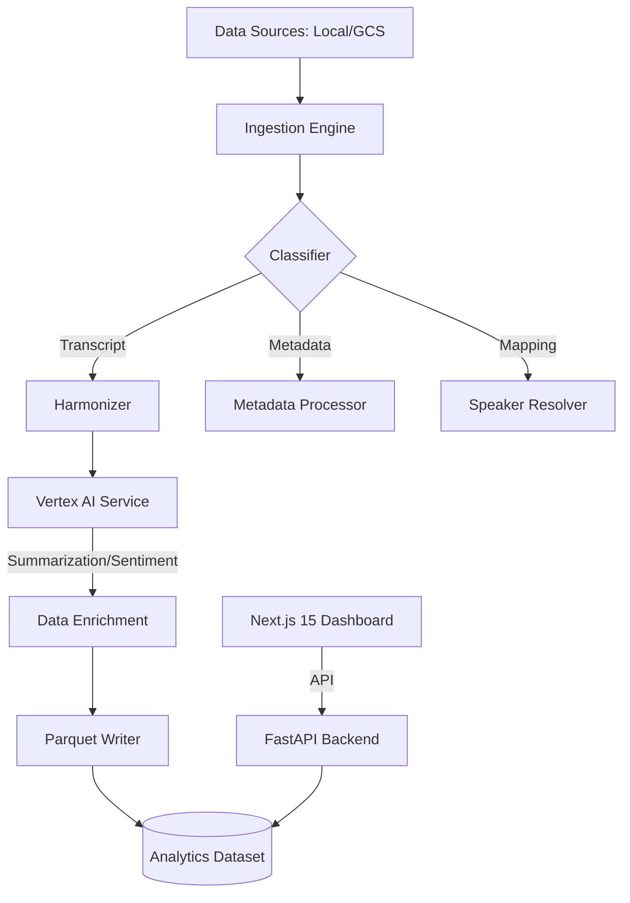

# 🌌 Transcript Intelligence Platform (TIP)

[](https://cloud.google.com)
[](https://nextjs.org)
[](https://fastapi.tiangolo.com)
[](https://cloud.google.com/vertex-ai)

**TIP** is an enterprise-grade, cloud-native intelligence engine designed to ingest, harmonize, and analyze fragmented transcript datasets at scale. It transforms unstructured conversational data into analytics-ready insights using advanced schema dynamic classification and Vertex AI enrichment.

---

## 🔗 Live Links

* **Live Demo Dashboard**: [https://tip-frontend-509380768243.us-central1.run.app](https://tip-frontend-509380768243.us-central1.run.app)
* **Production API**: [https://tip-backend-509380768243.us-central1.run.app/api/v1](https://tip-backend-509380768243.us-central1.run.app/api/v1)

---

## 🚀 Vision
In the modern enterprise, transcripts are scattered across different platforms, formats, and schemas. **TIP** provides the "Single Pane of Glass" for conversational intelligence by:
1.  **Harmonizing** inconsistent structures into a unified schema.
2.  **Resolving** speaker identities across disparate data sources.
3.  **Enriching** conversations with AI-generated summaries and sentiment analysis.
4.  **Operationalizing** data for downstream BI and LLM fine-tuning via Parquet.

---

## 🏗️ Architecture



---

## 🛠️ Tech Stack

### Backend (The Intelligence Layer)
- **FastAPI**: High-performance async API framework.
- **Polars & Pandas**: Blazing fast data manipulation and Parquet generation.
- **Vertex AI (Gemini 1.5 Pro)**: Automated summarization and sentiment extraction.
- **Google Cloud Storage**: Scalable cloud-native blob storage.

### Frontend (The Observability Layer)
- **Next.js 15 (App Router)**: The foundation of the interactive dashboard.
- **Tailwind CSS & Shadcn/UI**: Modern, vibrant, and accessible UI components.
- **React Flow**: Animated pipeline visualization for operational transparency.
- **Lucide React**: Clean, consistent enterprise iconography.

---

## ⚡ Quick Start

### 1. Environment Configuration
Create a `.env` file in the root directory:
```env
# Storage Configuration
STORAGE_TYPE=gcs  # or 'local'
GCP_PROJECT_ID=tip-intelligence-platform
GCS_BUCKET_NAME=tip_dataset_1

# Vertex AI Settings
VERTEX_LOCATION=us-central1
```

### 2. Local Development
```bash
# Install dependencies
pip install -r backend/requirements.txt
cd frontend && npm install

# Start Backend
python -m backend.main

# Start Frontend
cd frontend && npm run dev
```

### 3. Docker Deployment
```bash
docker-compose up --build
```

---

## 🌩️ Google Cloud Deployment

### Containerization (Cloud Run)
```bash
# Build and Push
gcloud builds submit --tag gcr.io/$PROJECT_ID/tip-backend .

# Deploy
gcloud run deploy tip-backend \
  --image gcr.io/$PROJECT_ID/tip-backend \
  --platform managed \
  --set-env-vars STORAGE_TYPE=gcs,GCP_PROJECT_ID=$PROJECT_ID
```

---

## 📊 Ingestion Workflow
1.  **Scan & Discover**: Recursive scanning of GCS/Local paths.
2.  **Dynamic Classification**: Key-based schema detection (Confidence > 90%).
3.  **Speaker Resolution**: Cross-referencing mapping files to normalize speaker IDs.
4.  **Vertex AI Enrichment**: Real-time generation of executive summaries.
5.  **Parquet Export**: Optimized persistence for BigQuery/Pandas ingestion.

---

## 🛡️ Observability & Anomalies
TIP logs every schema mismatch, missing key, or API failure as a structured **Anomaly**.
- View real-time logs in the **Dashboard Anomaly Hub**.
- Export anomaly datasets for data-engineering remediation.

---

## 🛤️ Roadmap
- [x] Phase 1: Local Ingestion & Harmonization
- [x] Phase 2: GCP Native Integration & Vertex AI
- [x] Phase 3: Next.js 15 Intelligence Dashboard
- [ ] Phase 4: Real-time Streaming (Webhooks/Kafka)

---
*Built with ❤️ for Advanced Transcript Intelligence.*
