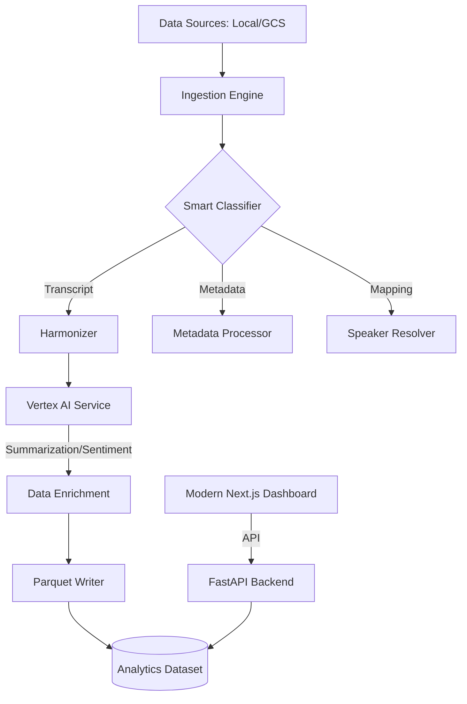

# 🌌 Transcript Intelligence Platform (TIP)

[](https://cloud.google.com)
[](https://nextjs.org)
[](https://fastapi.tiangolo.com)
[](https://cloud.google.com)

Welcome to **TIP**! We built this platform to solve a common headache in big companies: having thousands of meeting transcripts scattered everywhere in different formats. TIP is an enterprise-grade engine that "cleans up" this mess—ingesting, harmonizing, and analyzing fragmented data so you can actually use it for insights.

---

## 🏗️ How it Works (The Architecture)

We designed TIP with a modular, scalable architecture. It basically acts as a smart pipeline that takes messy raw data and turns it into structured, AI-enriched knowledge.



---

## 🚀 Why we built this
Most companies have transcripts, but they're often unusable because:
1.  **They don't match**: Every tool exports data differently. We **harmonize** them.
2.  **Who is talking?**: Speaker IDs are often inconsistent. We **resolve** them.
3.  **Information Overload**: Nobody can read 1,000 transcripts. We use **Vertex AI** to summarize them and detect sentiment automatically.
4.  **Ready for Analysis**: We save everything as **Parquet** files, making it easy for data scientists to plug into BigQuery or LLMs.

---

## 🛠️ Our Tech Stack

### The Brain (Backend)
- **FastAPI**: To keep things fast and asynchronous.
- **Polars & Pandas**: For high-speed data crunching and Parquet generation.
- **Vertex AI (Gemini 1.5 Pro)**: The "magic" layer for automated summaries and sentiment.
- **Google Cloud Storage**: For reliable, cloud-native storage.

### The Face (Frontend)
- **Next.js 15**: A lightning-fast dashboard foundation.
- **Tailwind CSS & Shadcn/UI**: For a sleek, premium look and feel.
- **React Flow**: To give you a live, animated view of your data pipeline.
- **Lucide React**: For clean, modern enterprise icons.

---

## ⚡ Getting Started

### 1. Set up your environment
Create a `.env` file in the root:
```env
# Storage Configuration
STORAGE_TYPE=local  # or 'gcs'
GCP_PROJECT_ID=your-project-id
GCS_BUCKET_NAME=your-bucket-name

# Vertex AI Settings
VERTEX_LOCATION=us-central1
```

### 2. Run it locally
```bash
# Install everything
pip install -r backend/requirements.txt
cd frontend && npm install

# Start the services
python -m backend.main
cd frontend && npm run dev
```

### 3. Deploy with Docker
```bash
docker-compose up --build
```

---

## 📊 The Ingestion Flow
1.  **Scan**: We find your files wherever they hide (Local or GCS).
2.  **Classify**: Our engine identifies the schema with over 90% confidence.
3.  **Resolve**: We link speaker names to IDs so the data makes sense.
4.  **Enrich**: Vertex AI reads the transcript and writes an executive summary.
5.  **Export**: Everything is saved into optimized Parquet files.

---

## 🛡️ Reliability & Monitoring
We built TIP to be robust. Every single error—from a missing key to a failed API call—is logged as an **Anomaly**. You can track these in real-time on the **Anomaly Hub** in the dashboard.

---

## 🛤️ What's Next?
- [x] Phase 1: Core Ingestion & Harmonization
- [x] Phase 2: Vertex AI Integration
- [x] Phase 3: Interactive Intelligence Dashboard
- [ ] Phase 4: Real-time Data Streaming

---
*Built with passion for smarter data engineering.*
